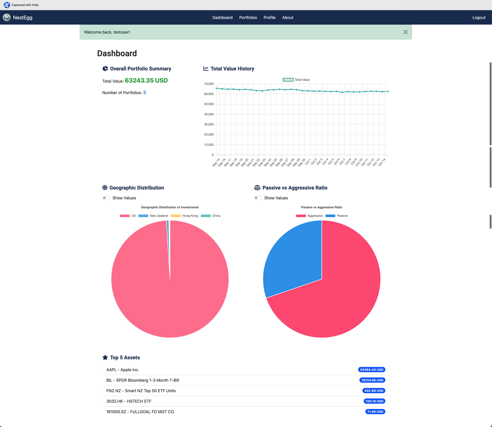
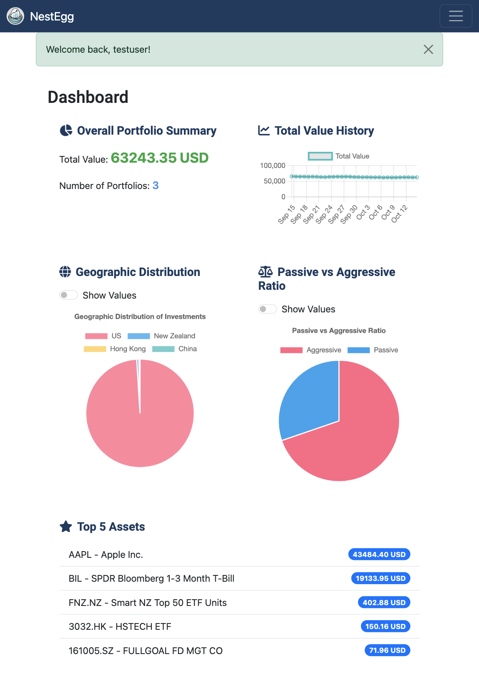
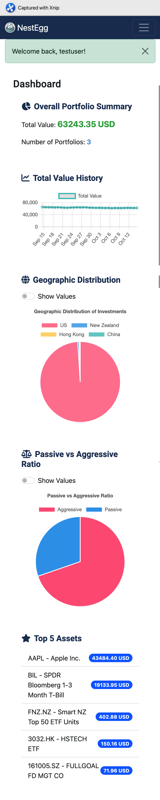
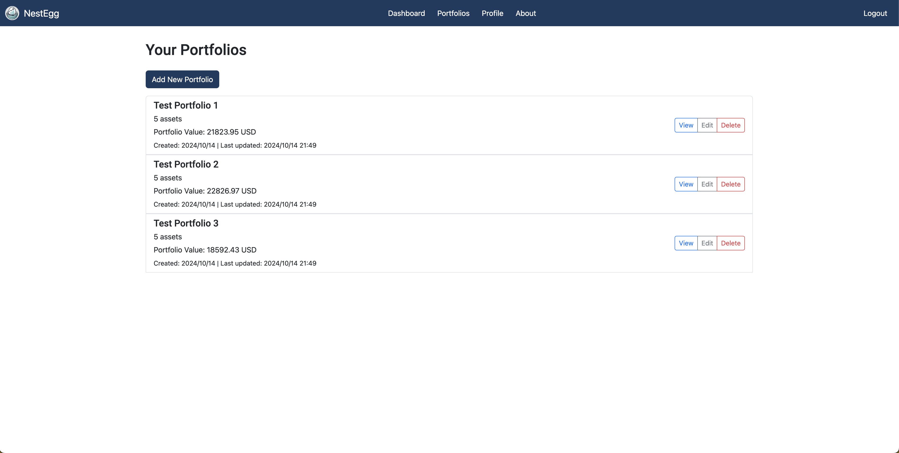
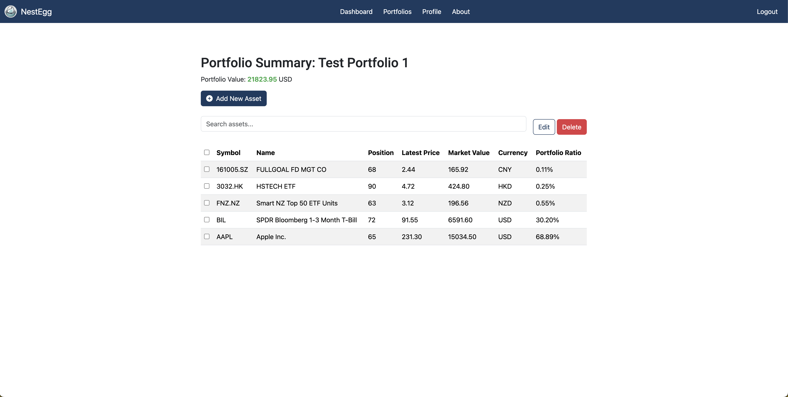
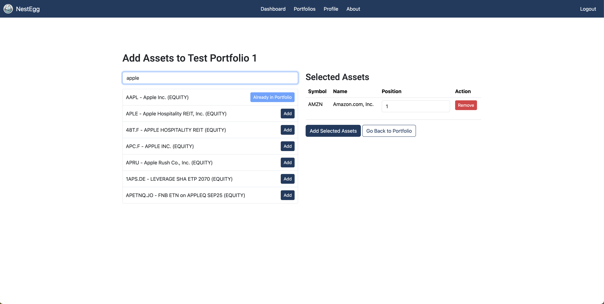

# NestEgg: Your Personal Investment Portfolio Tracker

<p align="left">
    <a href="https://github.com/lucaplayground/nestegg](https://github.com/lucaplayground/nestegg">
        
    </a>
    <a href="https://www.djangoproject.com/">
        
    </a>
    <a href="https://www.python.org/">
        
    <a href="https://opensource.org/licenses/MIT">
        
    </a>        
    </a>
</p>

NestEgg is a web application designed to help individual investors manage and track their investment portfolios with ease. It offers a comprehensive suite of tools for monitoring diverse assets across multiple portfolios, providing real-time insights into your investment strategy and performance. 

NestEgg is ideal for long-term individual investors who aren’t concerned with short-term stock price changes (as we don’t track individual profits 😄) but focus on their overall financial growth.

## Table of Contents
1. [Key Features](#key-features)
2. [UI Design](#ui-design)
3. [UI Showcase](#ui-showcase)
4. [Project Structure](#project-structure)
5. [Security Measures](#security-measures)
6. [Setup and Installation](#setup-and-installation)
7. [Production Environment](#production-environment)
8. [Usage Guide](#usage-guide)
9. [Testing with Admin Commands](#testing-with-admin-commands)
10. [Current Limitations and Future Considerations](#current-limitations-and-future-considerations)
11. [Contributing](#contributing)
12. [License](#license)

## Key Features
1. **Multi-Portfolio Management**: Create and manage multiple investment portfolios, allowing you to organise your investments by strategy, goal, or other criteria.
2. **Diverse Asset Tracking**: Track a wide range of assets including stocks, bonds, ETFs, and more from various global markets.
3. **Real-Time Data**: Utilises up-to-date market data to provide accurate valuations of your assets and overall portfolio.
4. **Currency Conversion**: Automatically handles multiple currencies, converting all asset values to your preferred currency for consistent reporting.
5. **Interactive Dashboard**:
- View your total investment value across all portfolios
- Track your investment value history over time
- Analyse your investment distribution by geographic region
- Understand your investment strategy through Passive vs Aggressive asset allocation
6. **Detailed Portfolio Views**: Dive deep into each portfolio, seeing individual asset performances, ratios, and values.
7. **Asset Management**: Easily add, update, or remove assets from your portfolios as your investment strategy evolves.
User-Friendly Interface: Intuitive design makes it easy to navigate and understand your investments at a glance.
9. **Secure and Private**: Built with security in mind, ensuring your sensitive financial data remains protected.

## UI Design

NestEgg's user interface is designed with a focus on clarity, efficiency, and user-friendliness. Our design philosophy centers around providing a seamless experience for users to manage and analyze their investments.

### Design Principles

1. **Simplicity**: We've adopted a clean, uncluttered design that allows users to focus on their investment data without distractions.

2. **Consistency**: A consistent color scheme, typography, and layout across all pages ensure a cohesive user experience.

3. **Responsiveness**: The UI is designed to be fully responsive, providing an optimal viewing experience across a wide range of devices.

4. **Accessibility**: We've implemented high-contrast colour schemes and clear typography to ensure the app is accessible to users with various visual capabilities.

### Colour Scheme


The colour plaette are carefully chosen to reflect trust, professionalism, and clarity:

- **Primary Blue (#007bff)**: Represents trust and stability, used for primary actions and key information.
- **Accent Green (#28a745)**: Signifies growth and positive trends, used for highlighting gains.
- **Alert Red (#dc3545)**: Indicates caution or negative trends, used sparingly for important alerts or losses.
- **Neutral Gray (#6c757d)**: Provides balance and is used for secondary information and text.

### Typography

We use a combination of sans-serif fonts for optimal readability:

- **Headings**: Roboto, bold weight
- **Body Text**: Open Sans, regular weight


## UI Showcase

### Dashboard

<div style="display: flex; justify-content: space-between; align-items: flex-start;">
    
    
</div>

The dashboard provides a clear and comprehensive overview of your investment portfolio. It displays your total portfolio value, asset allocation, geographic distribution, and historical performance. The responsive design ensures a seamless experience across desktop, tablet, and mobile devices.

### Portfolio View


The portfolio view offers a detailed breakdown of individual portfolios. Users can see the assets within each portfolio, their current values, performance metrics, and allocation percentages. 

### Asset Management


The asset management page enables users to add, edit, or remove assets from their portfolios. 

### Add Assets


The Add Assets page integrates with the Yahoo Finance API to allow users to search for assets by name or ticker symbol, add assets to their portoflios, and adjust positions of assets.

## Project Structure

NestEgg follows a typical Django project structure with some custom applications:
```
nestegg/
    |-- backend/ # Main Django project directory

    |-- accounts/ # Custom user authentication app

    |-- investments/ # Core investment tracking app

    |-- static/ # Static files (CSS, JS, images)

    |-- templates/ # HTML templates

    |-- manage.py # Django's command-line utility

    |-- requirements.txt # Project dependencies
```

- The `backend` directory contains the main Django project settings and configurations.
- `accounts` handles user authentication and profiles.
- `investments` is the core app for managing portfolios and assets.
- Static files and templates are organised in their respective directories at the project root level for easy management.

This structure allows for modular development and clear separation of concerns between different parts of the application.

## Security Measures

NestEgg implements several security measures to protect user data and the application:

1. **Password Hashing**: User passwords are securely hashed using Django's built-in password hashing system.

2. **Environment Variables**: Sensitive information such as secret keys and database credentials are stored as environment variables, not in the codebase.

3. **Password Validation**: Django's password validation system is used to enforce strong password policies.

4. **CSRF Protection**: Cross-Site Request Forgery (CSRF) protection is enabled by default in Django and used throughout the application.

5. **SQL Injection Prevention**: Django's ORM is used for database queries, which helps prevent SQL injection attacks.

6. **XSS Protection**: Django's template system automatically escapes user input to prevent Cross-Site Scripting (XSS) attacks.

7. **User Authentication**: A custom user model is used with Django's authentication system to manage user accounts securely.

8. **Session Security**: Django's session framework is used to manage user sessions securely.

## Setup and Installation
1. Clone the repository:
   ```
   git clone https://github.com/yourusername/nestegg.git
   ```
2. Navigate to the project directory:
   ```
   cd nestegg
   ```
3. Create a virtual environment:
   ```
   python -m venv venv
   ```
4. Activate the virtual environment:
   - On Windows: `venv\Scripts\activate`
     
   - On macOS and Linux: `source venv/bin/activate`
5. Install the required packages:
   ```
   pip install -r requirements.txt
   ```
6.Set up the environment variables in the `.env` file:
- `DJANGO_SECRET_KEY`: Your Django secret key.

- `DJANGO_DEBUG`: Set to `False` to turn off debug mode in production..

- `DB_USER`: The username of your PostgreSQL user.

- `DB_PASSWORD`: The password of your PostgreSQL user.

- `DB_PORT`: The port where the PostgreSQL server is listening.

- `DB_HOST`: The host where the PostgreSQL server is running on.

- `DB_NAME`: The name of the database.

- `DJANGO_ALLOWED_HOSTS`: Your allowed hosts, e.g.,'your-domain.com' and 'www.your-domain.com.

- `EXCHANGE_API_KEY`: The API key for the ExchangeRate.
7. Set up the database:
   ```
   python manage.py makemigration
   python manage.py migrate
   ```
8. Create a superuser:
   ```
   python manage.py createsuperuser
   ```
9. Run the development server:
   ```
   python manage.py runserver
   ```

## Production Environment
When deploying NestEgg to a production environment, please consider the following:

1. **Secret Key**: Generate a new secret key and store it as an environment variable.

2. **Debug Mode**: Ensure `DEBUG` is set to `False` in your settings.

3. **Database**: Use a production-grade database like PostgreSQL.

4. **Static Files**: Use a CDN or configure your web server to serve static files.

5. **HTTPS**: Ensure all traffic is served over HTTPS.

6. **Environment Variables**: Store sensitive information (API keys, database credentials) as environment variables.

7. **Logging**: Configure appropriate logging for the production environment.

8. **HTTPS and HSTS**: While the application is designed to work with HTTPS, it doesn't enforce it. Implementing HTTPS and HTTP Strict Transport Security (HSTS) is crucial for a production environment.

7. **Secure Cookies**: The application doesn't currently enforce secure cookies. This should be implemented for production use.

For a detailed guide on deploying Django applications, refer to the [Django deployment checklist](https://docs.djangoproject.com/en/3.2/howto/deployment/checklist/).


## Testing with Admin Commands

NestEgg includes custom Django admin commands to facilitate testing and data population. To use these:

1. Ensure you're in your project's root directory.
2. Run the following command to populate your database with test data:

   ```
   python manage.py populate_fake_data
   ```

This command creates a test user, portfolios, and assets, allowing you to quickly set up a testing environment.

## Usage Guide
### Getting Started

1. **Registration**: 
   - Navigate to the registration page and create an account.
   - Choose your default currency during registration.

2. **Login**: 
   - Use your credentials to log in to your account.

### Managing Portfolios

1. **Create a Portfolio**:
   - From the dashboard, click on "Create New Portfolio".
   - Enter a name for your portfolio and select the currency.

2. **View Portfolios**:
   - Access the "My Portfolios" page to see an overview of all your portfolios.

3. **Portfolio Details**:
   - Click on a portfolio name to view its details, including assets and performance.

### Managing Assets

1. **Add Assets**:
   - In a portfolio, click "Add Asset".
   - Search for an asset by name or ticker symbol.
   - Enter the quantity and purchase details.

2. **Update Asset Positions**:
   - In the portfolio details, find the asset you want to update.
   - Click "Edit" and modify the quantity or other details.

3. **Remove Assets**:
   - In the portfolio details, select the assets you want to remove.
   - Click "Delete Selected" to remove them from your portfolio.

### Tracking Performance

1. **Dashboard Overview**:
   - The main dashboard shows your total portfolio value and performance over time.

2. **Portfolio Performance**:
   - In each portfolio's detail page, view individual asset performance and overall portfolio metrics.

3. **Asset Distribution**:
   - Check the "Geographic Distribution" and "Asset Type" charts on the dashboard for insights into your investment spread.

### Account Management

1. **Update Profile**:
   - Access your profile settings to update personal information or change your password.

2. **Change Default Currency**:
   - In profile settings, you can change your default display currency.
   - Note: This doesn't convert existing assets but affects new additions and overall display.

### Using the Mobile Version

- While fully functional on desktop, some tables may not display optimally on smaller screens.
- Use landscape mode on mobile devices for better viewing of detailed tables.


## Current Limitations and Future Considerations

While NestEgg provides robust functionality for tracking investments, there are some current limitations and areas for future improvement:

1. **Mobile Responsiveness**: Some pages with tables, such as the 'Add Assets' page, don't render optimally on small screens. Future updates will focus on improving the mobile experience.

2. **Currency Changes**: If a user changes their default currency, this change is not retroactively applied to the TotalValueHistory. In future versions, we plan to implement a currency conversion feature for historical data.

3. **Asset Coverage**: Currently, NestEgg only supports assets available on Yahoo Finance. We're exploring options to expand our asset coverage in future releases.

4. **Real-time Updates**: Asset prices are updated periodically rather than in real-time. Future versions may include more frequent or real-time price updates.

5. **Rate Limiting**: The application currently lacks rate limiting, which could make it vulnerable to abuse. Implementing rate limiting is a priority for future security enhancements.


## Contributing
Contributions are welcome! Please fork the repository and create a pull request with your changes.

## License
This project is licensed under the [MIT License](LICENSE.txt).
